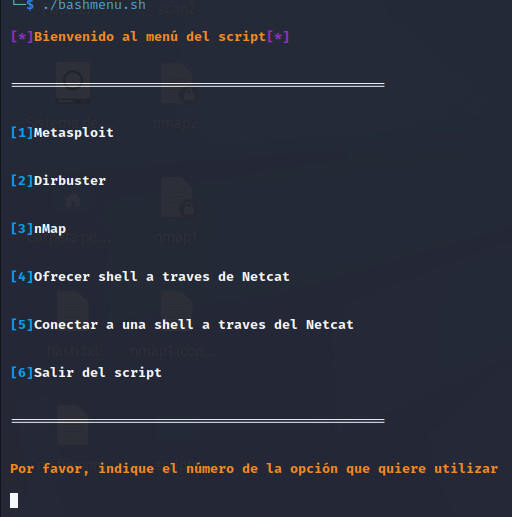

# bashmenu

Un script en Bash que despliega un menú con distintas funcionalidades: Usar Metasploit, usar Dirbuster, ofrecer una shell por Netcat, conectarse a una shell por Netcat, realizar un escaneo con Nmap.

REQUISITOS
======

Hay que otorgar permisos de ejecución: "chmod +x bashmenu.sh"
